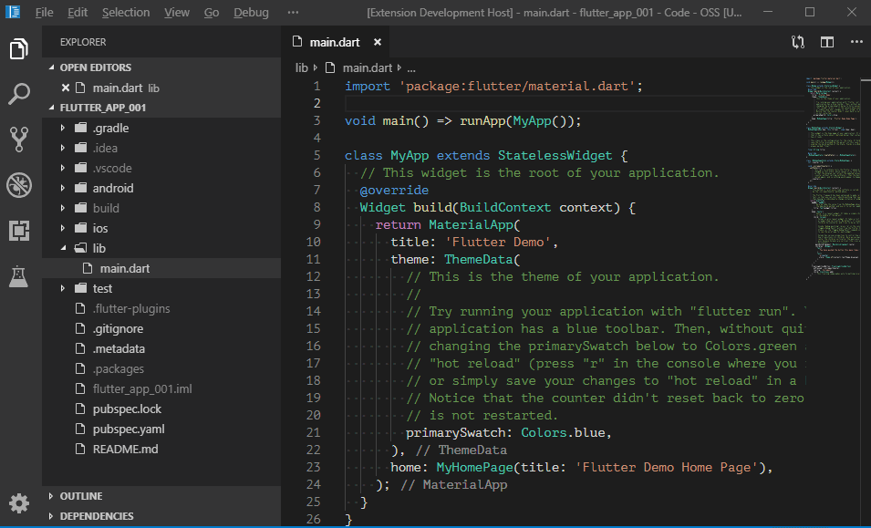

# flutter-androidx-checker

#### Features

- Check Flutter dependencies which use AndroidX

#### How to Use

1. Open file `pubspec.yaml`
2. Right click in the editor
3. Choose "Check dependecies (AndroidX)"

#### Demo

**Enjoy!**
